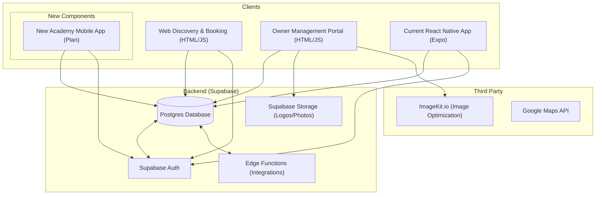
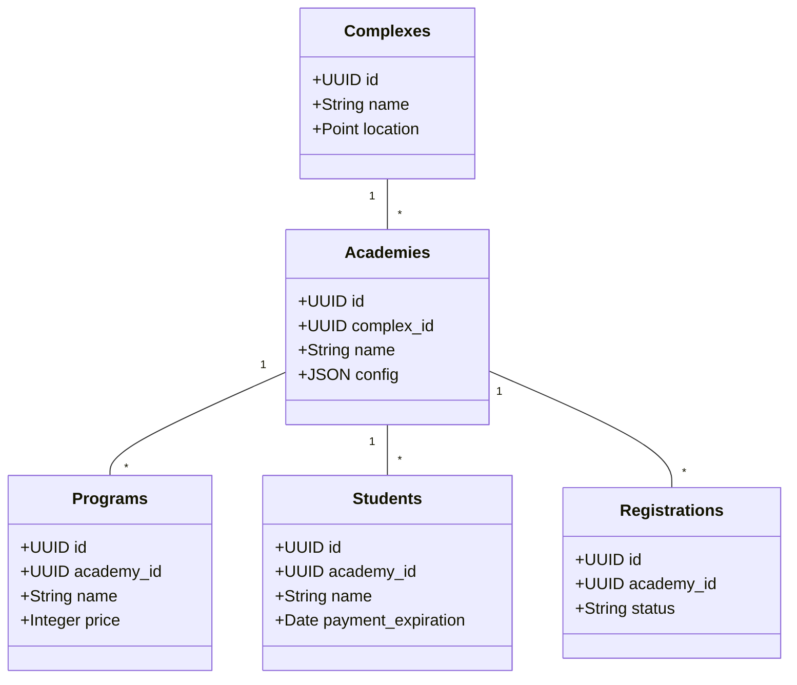

# System Architecture

This document describes the high-level architecture of the PitchPerfect ecosystem, including the current Web/Mobile components and the shared backend.

## Framework Overview

## Data Model (Core Entities)

## Key Flows

1. **Discovery**: Users browse `academies.html` -> Query Supabase `academies` joined with `complexes`.
2. **Registration**: Guest fills form -> Insert into `academy_registrations`.
3. **Management**: Owner views dashboard -> Manages students, coaches, and schedules via `academy_mgmt`.
